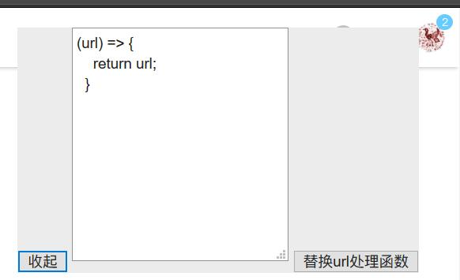

# 崮生的油猴脚本

[崮生的油猴脚本-greasyfork](https://greasyfork.org/zh-CN/users/210880-2234839) 你可以去这里查看我发布的全部油猴脚本

## 目前发布的脚本

### [网页文本编辑,做笔记的好选择 所见即所得！](./网页笔记/网页笔记.user.ts)

[安装地址](https://greasyfork.org/zh-CN/scripts/372082-网页文本编辑-做笔记的好选择)

这个脚本是我做了最久的，也是我最不满意的。他不应该是这样，我没能把他做好

### 讯飞文字转语音提取链接

[安装地址](https://greasyfork.org/zh-CN/scripts/383746-讯飞文字转语音提取链接)

用于讯飞文字转语音 https://www.ffkuaidu.com 直接下载

### [api 自动提取](./api自动提取/api自动提取.user.ts)

[安装地址](https://greasyfork.org/zh-CN/scripts/392139-api自动提取)

使用方式是打开控制台，输入\_api 你可以看到一些方法，在支持的网站执行对应的方法就 ok 了，

因为主要是自己用，所以碰到一些问题或如有其他需要可以提个 pr

#### 更新历史

2020-6-9 1.1.3::yapi

    新增自动展开收缩起来的参数

2020-5-14 1.1.2::yapi api 详情页

    新增 修改人列表功能
    新增 生成代码按钮，点击复制代码

### 百度翻译自动发音

[安装地址](https://greasyfork.org/zh-CN/scripts/371985-百度翻译自动发音)

### 哔哩哔哩直播去掉系统消息

[安装地址](https://greasyfork.org/zh-CN/scripts/388481-哔哩哔哩直播去掉系统消息)

干掉哪些烦人的东西

### 极客学院 md 文档中文版图片显示

[安装地址](https://greasyfork.org/zh-CN/scripts/392129-极客学院md文档中文版图片显示)

不知道什么原因 http://wiki.jikexueyuan.com/project/material-design/whatis-material-design/material-properties.html 的文档加载不出图片，于是我将他图片的地址修改为 github 的

### [祭奠百度](./祭奠百度/祭奠百度.user.ts)

[安装地址](https://greasyfork.org/zh-CN/scripts/401355-祭奠百度)

或许未来只有一片精致的灰 ！

### [去除顶部遮挡](./去除顶部遮挡/去除顶部遮挡.user.ts)

[安装地址](https://greasyfork.org/zh-CN/scripts/403713-去除顶部遮挡)

我算法不太行可能通用性不行，自测(简书，google，知乎)没问题

### [ansi_to_html](./ansi_to_html/ansi_to_html.user.ts)

[安装地址](https://greasyfork.org/zh-CN/scripts/404778-ansi-to-html)

### [请求代理](./请求代理/请求代理.user.ts)

[安装地址](https://greasyfork.org/zh-CN/scripts/406284-%E8%AF%B7%E6%B1%82%E4%BB%A3%E7%90%86)

通过在这里写 js 代码，插件内部会调用该代码来处理请求的 url，从而实现像生产的网站访问自己本地服务这样的效果，例如将下面的代码改为下面这样的，所有请求就都会发往本机服务了，要记得允许跨域

```javascript
(url) => {
    //return "http://127.0.0.1" + url;
    return  url.replace('http://domain'.'http://127.0.0.1');

}
```



通过在这里写 js 代码，插件内部会调用该代码来处理请求的 url，从而实现像生产的网站访问自己本地服务这样的效果

#### 实现思路

使用 [ajax-hook](https://github.com/wendux/Ajax-hook) 这个库可以很容易的在请求发起前修改请求参数，具体见 [请求代理.user.ts](./请求代理/请求代理.user.ts) 这里的代码

## [LICENSE](./LICENSE)
