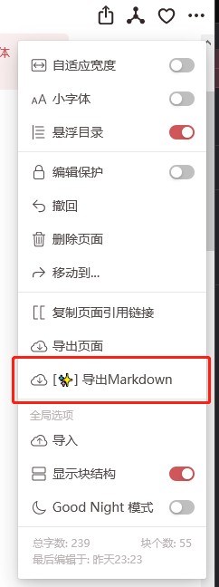

# 更好的我来导出

## 使用方式

油猴脚本启用成功之后在此处应当有一个如下图的按钮，点击后即可，如果更新了页面内容需要刷新后才能得到最新的

如果启用脚本后没有看见按钮可能是我来更新的网页结构，请联系我更新脚本✨

## 比谁更好？哪里更好？

Q : 比谁更好？

A : 比官方的导出更好！

---
Q : 哪里更好？

A : 有如下优点

    1. 导出的图片链接是可直接访问的（有时间限制，但用来粘贴到知乎之类的网站已经够了）
    2. 可以对我来内部引用地址进行其他操作，例如改成映射到自己博客相应地址，或者将 tag 类的引用标签直接清除掉
    3. 整个导出为 md 的代码是开源的，您可以修改成适合自己需要的功能
    4. 可以选择保留布局结构 （待完成）

