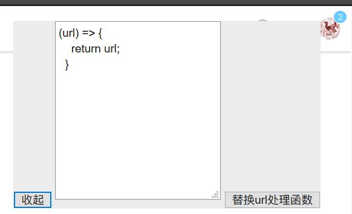

## 请求代理

通过在这里写 js 代码，插件内部会调用该代码来处理请求的 url，从而实现像生产的网站访问自己本地服务这样的效果，例如将下面的代码改为下面这样的，所有请求就都会发往本机服务了，要记得允许跨域

```javascript
(url) => {
    return  url.replace('http://domain','http://127.0.0.1');
}
```

